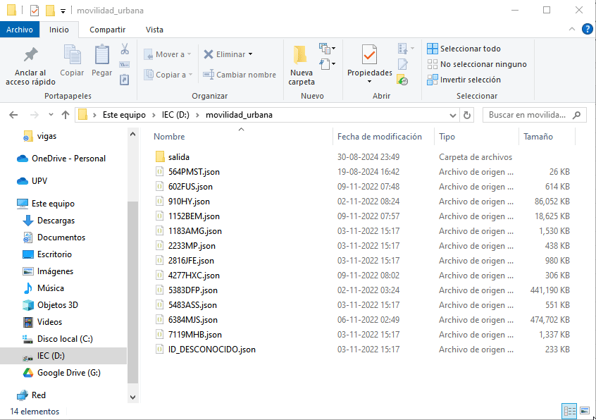
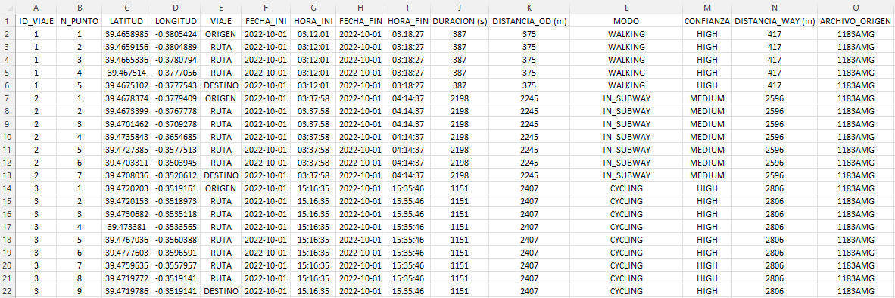

# Instrucciones

<p style="text-align: justify;">
Los archivos en formato JSON obtenidos del Historial de Ubicaciones de Google deben estar ubicados en una única carpeta. El programa te pedirá que indiques esta carpeta para integrar todos los archivos en un solo archivo Excel. Este Excel contendrá la información más relevante, optimizada para su posterior integración con los datos de los diarios de viaje.
</p>

## Ejemplo de JSON

<p style="text-align: justify;">
Este es el formato aproximado inicial que deben tener los archivos JSON para su análisis. Asegúrate de que tus archivos sigan esta estructura, ya que es esencial para que el software pueda generar correctamente los datos relacionados con los viajes realizados. Cada entrada en el JSON debe contener la información básica necesaria, como la marca de tiempo, la latitud, la longitud y la precisión, así como cualquier actividad asociada a ese momento específico.

Es fundamental que todos los archivos JSON que quieras analizar mantengan esta estructura, ya que cualquier desviación podría afectar la precisión de los resultados generados por el software. A continuación, se presenta un ejemplo del formato JSON requerido para asegurar una integración y análisis efectivos.
</p>

!!! hint

    Es importante destacar que el archivo JSON puede tener como segunda clave tanto "placeVisit" como "activitySegment" sin afectar el funcionamiento del software.

````json
{
  "timelineObjects": [{
    "activitySegment": {
      "startLocation": {
        "latitudeE7": 394807539,
        "longitudeE7": -3427222,
        "sourceInfo": {
          "deviceTag": -1364780865
        }
      },
      "endLocation": {
        "latitudeE7": 394754983,
        "longitudeE7": -3471247,
        "sourceInfo": {
          "deviceTag": -1364780865
        }
      },
      "duration": {
        "startTimestamp": "2022-10-20T19:16:10.414Z",
        "endTimestamp": "2022-10-20T19:28:00.690Z"
      },
      "distance": 751,
      "activityType": "WALKING",
      "confidence": "HIGH",
      "activities": [{
        "activityType": "WALKING",
        "probability": 86.69926524162292
      }, {
        "activityType": "STILL",
        "probability": 6.853951513767242
````

## Salida

<p style="text-align: justify;">
En la misma carpeta que selecciones para los archivos JSON, el software generará automáticamente una nueva carpeta llamada <i>salida</i>. Dentro de esta carpeta, se encontrará un archivo Excel denominado <i>resumen.xlsx</i>, que contiene la integración de todos los archivos JSON procesados. Este archivo <i>resumen.xlsx</i> consolida toda la información relevante de los datos de movilidad, facilitando su análisis y comparación con otros conjuntos de datos, como los diarios de viaje.
</p>



### Columnas del archivo resumen.xlsx


1.	ID_VIAJE: Representa un identificador asignado a cada viaje encontrado en los datos por archivo. Este ID se repite para cada punto de ubicación registrado durante el mismo viaje.

2.	N_PUNTO: Número secuencial asignado a cada punto de ubicación dentro de un viaje. Este valor incrementa con cada punto registrado, permitiendo reconstruir la ruta completa del viaje en función de este atributo.

3.	LATITUD: Latitud geográfica del punto de ubicación, expresada en el sistema de referencia espacial EPSG:4326 (también conocido como WGS 84). Este formato es el estándar global para sistemas de posicionamiento geográfico.

4.	LONGITUD: Longitud geográfica del punto de ubicación, también en el sistema EPSG:4326 (WGS 84).

5.	VIAJE: Clasificación de los puntos dentro de un viaje. El primer punto se etiqueta como ORIGEN, el último como DESTINO, y los puntos intermedios se etiquetan como RUTA. Esta columna ayuda a distinguir las diferentes fases del trayecto.

6.	FECHA_INI: Fecha en la que comienza el viaje, registrada según la zona horaria GMT 0.

7.	HORA_INI: Hora exacta en la que inicia el viaje, también en la zona horaria GMT 0.

8.	FECHA_FIN: Fecha de finalización del viaje, utilizando el mismo huso horario GMT 0.

9.	HORA_FIN: Hora de finalización del viaje, en GMT 0.

10.	DURACION (s): Duración total del viaje, expresada en segundos. Este valor permite analizar la extensión temporal de los desplazamientos.

11.	DISTANCIA_OD (m): Distancia en línea recta entre el origen y el destino del viaje, expresada en metros. Este valor representa la distancia mínima que cubre el trayecto sin tener en cuenta las desviaciones o cambios de dirección.

12.	MODO: Modo de transporte detectado para el viaje (por ejemplo, a pie, en bicicleta, en coche). Este dato puede ayudar a identificar patrones de movilidad.

13.	CONFIANZA: Nivel de confianza asociado a la detección del modo de transporte utilizado durante el viaje.

14.	DISTANCIA_WAY (m): Distancia total recorrida durante el viaje, en metros, teniendo en cuenta todos los puntos de la ruta. Este valor refleja la longitud real del trayecto, considerando las desviaciones y cambios en la ruta.

15.	ARCHIVO_ORIGEN: Nombre del archivo JSON del que provienen los datos procesados. Este campo es útil para rastrear el origen de la información, especialmente cuando se están procesando múltiples archivos JSON.


